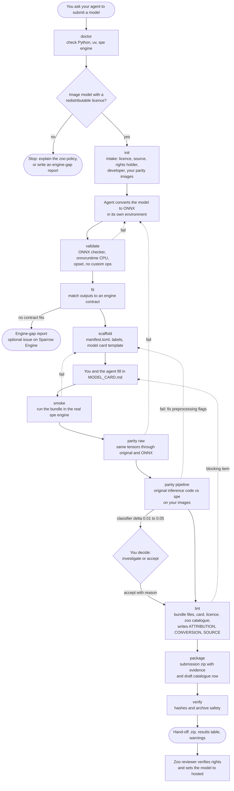

# Sparrow Model Zoo Uploader

Convert an image model to a [Sparrow Engine](https://github.com/microsoft/SPARROW-Engine)
model bundle, prove that it gives the same results as the original, and package it for
submission to the Sparrow model zoo. A coding agent does the work, guided by a skill.

The repository contains two parts:

- **An agent skill** (`skills/sparrow-model-uploader/`). It tells a coding agent (Claude Code,
  GitHub Copilot CLI, Codex, Gemini CLI and others) what to ask you, how to convert your model
  to ONNX, which checks to run, and what to do when a check fails. Third-party models differ a
  lot in framework, preprocessing and output format, so the conversion itself is agent work.
- **The `sparrow-uploader` command-line tool.** It runs the fixed checks the same way for every
  model: ONNX validation, engine manifest generation, a run in the real engine, parity against
  the original model, bundle lint, packaging, and verification. Every command writes an
  evidence file, and the submission package carries that evidence to the zoo reviewer.

The agent calls the tool; it does not write its own checks. You can also run the tool by hand.

**Supported in this version:** image **detectors**, **classifiers** and **image encoders**
(camera-trap, overhead, marine or general images). Sparrow Engine also runs audio models; this
version of the uploader does not package them yet. Video models are not supported by the engine.

For what to prepare and how review works, read the [submission guide](docs/user-guide.md).

## How it works



Each step writes `.sparrow-upload/<model_id>/evidence/<step>.json` with a result of `pass`,
`warn`, `fail` or `skipped`. A dotted arrow is the usual fix when a step fails. A failed gate is
fixed at its cause; the skill forbids loosening a threshold to get a pass.

## Requirements

- Python 3.11–3.13 and [uv](https://docs.astral.sh/uv/).
- Sparrow Engine's `spe` command, version 0.1.30. It is not on PyPI (the `sparrow-engine` wheel
  there is the Python API only). Install it with
  `brew install microsoft/sparrow-engine/sparrow-engine`, or download
  `sparrow-engine-cpu-0.1.30-<platform>.tar.gz` from the
  [v0.1.30 release](https://github.com/microsoft/SPARROW-Engine/releases/tag/v0.1.30), extract
  it and put its `bin/` on `PATH`.
- A model whose **weights** licence allows redistribution. Non-commercial licences are not
  accepted by the zoo.
- 10–50 of your own images the model should work on (recommended; see the guide).

## Install

The command-line tool (not on PyPI yet; install from this repository):

```bash
uv tool install git+https://github.com/microsoft/Sparrow-Model-Zoo-Uploader
sparrow-uploader doctor
```

Models whose source is PyTorch or Ultralytics need the optional extra for the raw-parity check:

```bash
uv tool install 'sparrow-model-uploader[ultralytics] @ git+https://github.com/microsoft/Sparrow-Model-Zoo-Uploader'
```

The agent skill, pick one:

```bash
# Claude Code
claude plugin marketplace add microsoft/Sparrow-Model-Zoo-Uploader
claude plugin install sparrow-model-uploader

# GitHub Copilot CLI
copilot plugin install microsoft/Sparrow-Model-Zoo-Uploader

# Gemini CLI
gemini extensions install https://github.com/microsoft/Sparrow-Model-Zoo-Uploader

# Any agent that reads a skills folder: copy the skill bundled with the CLI
sparrow-uploader install-skill --target claude     # ~/.claude/skills
sparrow-uploader install-skill --target copilot    # ~/.copilot/skills
sparrow-uploader install-skill --target codex      # ~/.agents/skills
sparrow-uploader install-skill --dest /path/to/skills
```

Then ask your agent: *"Help me submit my model to the Sparrow model zoo."*

## Using the CLI directly

```bash
M=my-deer-detector
sparrow-uploader init --model-id $M --task detector --domain camera_trap --license MIT \
  --source https://example.org/weights --developer "My Lab" --reference https://doi.org/... \
  --description "Deer detector" --submitter my-hf-user --parity-data ./my_images \
  --rights-holder "My Lab" --license-url https://example.org/LICENSE \
  --display-name "My Deer Detector" --source-weights ./downloaded/weights.pt
sparrow-uploader validate --model-id $M model.onnx
sparrow-uploader fit --model-id $M
sparrow-uploader scaffold --model-id $M --labels labels.txt --license-file LICENSE.txt \
  --preprocess letterbox --normalization unit --interpolation cv2_bilinear \
  --family MyFamily --version v1 --geo-scope regional --geo-regions north_america
# edit the bundle's MODEL_CARD.md and replace every TODO
sparrow-uploader smoke --model-id $M
sparrow-uploader parity raw --model-id $M --source-torchscript model.pt
sparrow-uploader parity pipeline --model-id $M --reference reference_predictions.json
sparrow-uploader lint --model-id $M
sparrow-uploader package --model-id $M --out dist
sparrow-uploader verify dist/$M-submission.zip
```

Every command prints JSON on stdout. Exit codes: `0` pass or warn, `1` gate failed, `2` usage or
input error. `sparrow-uploader <command> --help` lists all options;
`sparrow-uploader capabilities` lists what the installed engine can run.

## What gets checked

| Check | Command | Passes when |
|---|---|---|
| ONNX is valid and portable | `validate` | `onnx.checker` passes, loads in onnxruntime CPU, opset ≥ 17, no external data, no custom ops |
| Engine can run it | `fit`, `smoke` | output layout matches an engine contract; `spe` runs the bundle with sane outputs |
| Conversion is exact | `parity raw` | max abs delta ≤ 1e-3 and cosine ≥ 0.999999 against the original model |
| Preprocessing matches | `parity pipeline` | detectors: every detection matched (IoU ≥ 0.5); classifiers: same top-1, probability delta ≤ 0.01 (0.01–0.05 needs your decision); encoders: cosine ≥ 0.99 |
| Bundle is complete | `lint` | labels, licence text, filled-in model card, unique id, zoo compliance files |

Details: [parity gates](skills/sparrow-model-uploader/references/parity-gates.md).

## What is in the submission package

`<model_id>-submission.zip` contains:

- the engine bundle: `manifest.toml`, `1/model.onnx`, `labels.txt`, `MODEL_CARD.md`,
  `LICENSE.md`, and the generated `ATTRIBUTION.md`, `CONVERSION.md`, `SOURCE.md`,
  `SOURCE_ARTIFACT.json`;
- the evidence file from every step and your reference predictions;
- `submission.json`: a draft zoo catalogue row with the rights fields, tool versions and the
  sha256 of every file. It is marked `hosting_status = "pending_rights"`, and its
  `review_required` block lists the fields the zoo reviewer sets on approval.

It never contains your parity images, your email address, or local file paths.

## Submitting

Uploading the package for review is not automated yet. Keep the zip; submission instructions
will be added here. See the [submission guide](docs/user-guide.md) for what the reviewer checks.

## Contributing

See [CONTRIBUTING.md](CONTRIBUTING.md) for the code layout, conventions and the Contributor
License Agreement. Report bugs on [GitHub Issues](SUPPORT.md).

## Trademarks

This project may contain trademarks or logos for projects, products, or services. Authorized use
of Microsoft trademarks or logos is subject to and must follow
[Microsoft's Trademark & Brand Guidelines](https://www.microsoft.com/legal/intellectualproperty/trademarks/usage/general).
Use of Microsoft trademarks or logos in modified versions of this project must not cause
confusion or imply Microsoft sponsorship. Any use of third-party trademarks or logos are subject
to those third-party's policies.

## License

MIT. See [LICENSE](LICENSE). Models you package keep their own licence.
